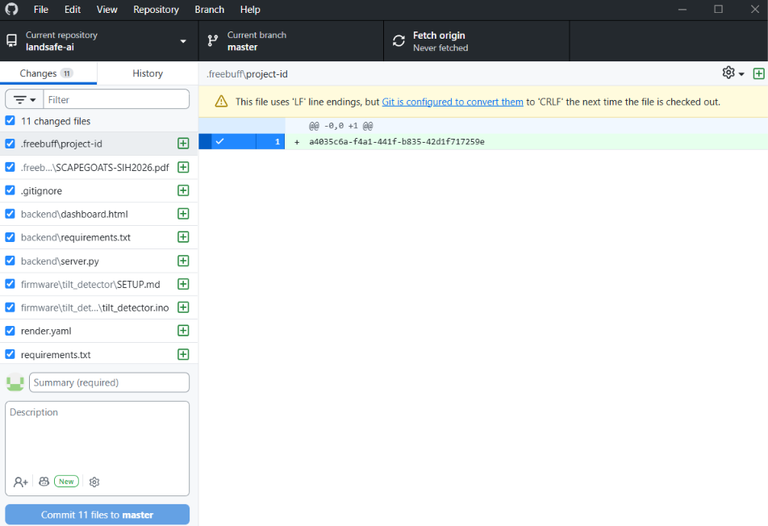

# Landsafe AI — AI-Based Early Warning & Landslide Risk Monitoring for North Eastern India

> Real-time landslide risk monitoring platform built for the **Smart India Hackathon** — combining a low-cost IoT sensor node, live regional weather intelligence, and a public web dashboard with instant alerts.

**Live demo:** https://landsafe-ai.onrender.com



---

## The Problem

The North Eastern Region (NER) of India suffers frequent landslides driven by heavy rainfall, fragile Himalayan terrain, and unplanned hill cutting. Monitoring today is **reactive** — dependent on manual reporting after roads are already blocked and villages cut off. Professional monitoring stations cost ₹3–20 lakh each, so coverage is sparse and expensive.

## Our Solution

A **dense, low-cost monitoring network**: ESP32-based sensor nodes (~₹1,800/node vs ₹3–20 lakh for commercial stations) deployed on vulnerable slopes, streaming live tilt + soil saturation data to a cloud platform that anyone can access from anywhere — with automated alerts that work even on silent phones (siren + vibration + push notifications, in 5 languages).

| Layer | What it does |
|---|---|
| **Sensor Node** | ESP32 + MPU-6500 inclinometer + soil moisture + OLED display — computes risk locally with a median filter and posts to the cloud over WiFi |
| **Cloud Backend** | FastAPI + WebSocket — ingests node data, fuses it with live Open-Meteo rainfall and satellite soil moisture for 10 real NER corridor locations |
| **Dashboard** | Single-page PWA — live risk scores, GIS map, multi-station view, citizen geo-tagged photo reporting, historical landslide database |
| **Alerts** | Browser push notifications, loud siren, continuous vibration on danger, 48-hour rain forecast risk per state, 5 languages (EN/HI/AS/BN/MN) |

## Key Features

- **Live tilt gauge** with warning (10°) and danger (60°) thresholds, auto-calibrated on boot
- **Real regional risk scores** — not random data: actual 24h rainfall + satellite soil moisture per corridor, fused into an explainable risk model (45% rain / 55% saturation, amplified by slope steepness)
- **48-hour rain forecast** — per-state early warning based on real meteorological predictions
- **GIS map** of NE India with monitored corridors, live weather markers, and hazard badges
- **Citizen reporting** — geo-tagged photos of cracks, slope movement, and blocked roads
- **Historical database** of 24 real NER landslide incidents (2015–2025) with analytics
- **Offline support** — PWA with service worker; the sensor node displays status on-site with zero connectivity
- **Zero-cost stack** — free hosting (Render), free weather data (Open-Meteo), free map tiles (ArcGIS/Leaflet)

## Architecture

```
┌─────────────────────┐    WiFi/POST     ┌──────────────────┐   WebSocket   ┌─────────────────┐
│  ESP32 Sensor Node  │ ───────────────▶ │  FastAPI Backend │ ────────────▶ │  Public Dashboard│
│  MPU-6500 tilt      │   every 2 sec    │  (Render cloud)  │  real-time    │  (PWA, any device)│
│  Soil moisture      │                  │  + Open-Meteo    │               │  siren/vibrate/  │
│  OLED local display │                  │  regional data   │               │  notifications   │
└─────────────────────┘                  └──────────────────┘               └─────────────────┘
```

## Hardware Bill of Materials (~₹1,800/node)

| Component | Purpose | Cost |
|---|---|---|
| ESP32 DevKit | MCU with WiFi | ₹350 |
| MPU-6500 / MPU-6050 | Tilt / vibration (landslide precursor) | ₹150 |
| Capacitive soil moisture sensor | Soil saturation | ₹120 |
| 0.96" SSD1306 OLED | On-site status, works offline | ₹180 |
| Solar panel 6V + TP4056 + 18650 | Untethered deployment | ₹330 |
| IP65 enclosure + wiring | Field-ready | ₹250 |
| Misc (headers, perfboard, spares) | Assembly | ₹420 |

## Repository Structure

```
├── backend/
│   ├── server.py          # FastAPI — all endpoints, WebSocket, risk engine
│   ├── dashboard.html     # Full dashboard PWA (single file)
│   ├── sw.js              # Service worker (offline + notifications)
│   ├── manifest.json      # PWA manifest
│   └── historical.json    # Real NER landslide incident database
├── firmware/
│   └── tilt_detector_oled/  # Main ESP32 firmware (OLED intro, median filter,
│                             # auto-calibration, cloud posting)
└── docs/screenshots/
```

## API Endpoints

| Endpoint | Method | Purpose |
|---|---|---|
| `/api/tilt` | POST | Sensor nodes submit tilt + moisture readings |
| `/api/latest` | GET | Latest reading with computed risk |
| `/api/stations` | GET | 10 NER corridors with live Open-Meteo data + risk scores |
| `/api/historical` | GET | Historical landslide incidents |
| `/api/report` | POST | Citizen report submission |
| `/api/risk` | GET | Risk calculation |
| `/ws` | WebSocket | Real-time dashboard stream |
| `/docs` | GET | Auto-generated interactive API docs (FastAPI) |

## Tech Stack

**Hardware:** ESP32, MPU-6500 (I2C), capacitive soil moisture, SSD1306 OLED
**Firmware:** Arduino C++ — median-of-9 filtering, 500-sample auto-calibration, on-device risk classification
**Backend:** Python, FastAPI, WebSockets, Open-Meteo API (rain + satellite soil moisture)
**Frontend:** Vanilla JS PWA, Leaflet GIS, Web Audio API siren, Vibration API, service worker
**Deployment:** Render (auto-deploys on push)

## Team

Built for Smart India Hackathon.

- Email: crastacalrin@gmail.com
- Phone: +91 70229 41015
- GitHub: [github.com/Alricvp/landsafe-ai](https://github.com/Alricvp/landsafe-ai)
